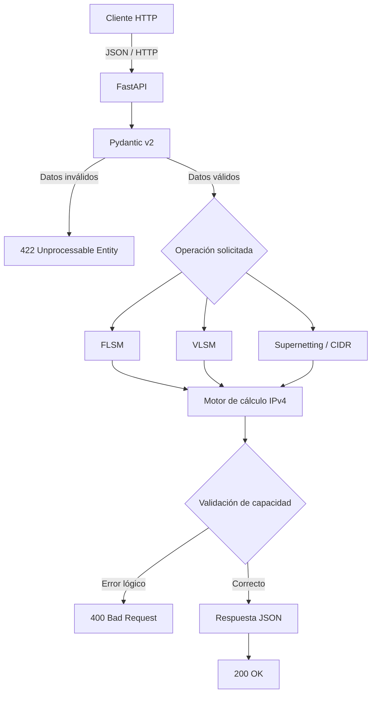

# NetSegment API

> API REST orientada a la planificación y optimización de direccionamiento IPv4 mediante FLSM, VLSM y sumarización de rutas CIDR.


---

## Descripción

**NetSegment API** es una solución de software diseñada para automatizar tareas de segmentación y planificación de redes IPv4.

El proyecto surge frente a los errores que pueden producirse al realizar cálculos de subnetting manualmente, como:

- asignación incorrecta de rangos IP;
- solapamiento entre subredes;
- desperdicio de direcciones IPv4;
- selección incorrecta de máscaras;
- planificación ineficiente de bloques de red;
- ausencia de sumarización de rutas.

La solución propone exponer estas operaciones mediante una **API REST**, permitiendo que los cálculos puedan ser utilizados no solamente por una persona, sino también por otras aplicaciones, scripts de automatización o herramientas de infraestructura.

Actualmente el proyecto se encuentra en una etapa de **diseño y prueba de concepto**. La arquitectura, las operaciones principales y el contrato esperado de la API se encuentran definidos; la implementación ejecutable deberá incorporarse posteriormente al repositorio.

---

## Objetivo

Desarrollar una API capaz de automatizar la planificación de direccionamiento IPv4, proporcionando operaciones confiables para:

1. división de redes mediante **FLSM**;
2. asignación eficiente de direcciones mediante **VLSM**;
3. agregación de redes mediante **Supernetting/CIDR**.

La solución busca reducir errores de cálculo y facilitar la integración del subnetting con otras herramientas de software.

---

## Principales funcionalidades

### FLSM — Fixed Length Subnet Mask

Permite dividir una red IPv4 en múltiples subredes de igual tamaño.

Para cada subred se podrá determinar información como:

- dirección de red;
- prefijo CIDR;
- máscara de subred;
- primera dirección utilizable;
- última dirección utilizable;
- dirección de broadcast;
- cantidad de hosts disponibles.

---

### VLSM — Variable Length Subnet Mask

Permite distribuir un bloque IPv4 utilizando máscaras de diferente longitud de acuerdo con las necesidades de hosts de cada segmento.

La estrategia propuesta organiza las solicitudes de mayor a menor capacidad antes de realizar la asignación, reduciendo la fragmentación y mejorando el aprovechamiento del espacio disponible.

---

### Supernetting / CIDR

Permite analizar redes contiguas y determinar si pueden ser representadas mediante una ruta agregada común.

Esta funcionalidad puede utilizarse para reducir la cantidad de entradas necesarias en una tabla de enrutamiento cuando los bloques cumplen las condiciones de alineamiento correspondientes.

---

## Usuarios objetivo

NetSegment API está orientada principalmente a:

- estudiantes de redes;
- administradores de infraestructura;
- ingenieros de redes;
- desarrolladores de software;
- equipos DevOps;
- herramientas de aprovisionamiento;
- sistemas de automatización de infraestructura;
- aplicaciones que necesiten realizar cálculos IPv4.

---

## Tipo de solución

El proyecto corresponde a una:

**API REST / microservicio backend para procesamiento de direccionamiento IPv4.**

La solución está planteada como un servicio **stateless**, por lo que los cálculos son procesados a partir de la información recibida en cada solicitud.

---

# Arquitectura

La arquitectura propuesta separa la comunicación HTTP, la validación de datos y la lógica de cálculo de redes.



### Flujo general

1. El cliente envía una solicitud HTTP en formato JSON.
2. FastAPI recibe la solicitud.
3. Pydantic valida los datos recibidos.
4. La solicitud se dirige hacia la operación correspondiente.
5. El motor de cálculo procesa las direcciones IPv4.
6. Se verifican límites, rangos y capacidad.
7. La API devuelve el resultado en formato JSON.

---

# Tecnologías utilizadas

| Componente | Tecnología | Función |
|---|---|---|
| Lenguaje | Python 3.11+ | Desarrollo de la lógica principal |
| Framework | FastAPI | Implementación de la API REST |
| Servidor ASGI | Uvicorn | Ejecución de la aplicación |
| Validación | Pydantic v2 | Validación y serialización de datos |
| Cálculo IPv4 | `ipaddress` | Manipulación de redes y direcciones IPv4 |
| Entorno virtual | `venv` | Aislamiento de dependencias |
| Control de versiones | Git | Gestión de cambios |
| Repositorio | GitHub | Almacenamiento y colaboración |
| Formato de intercambio | JSON | Requests y responses de la API |
| Protocolo | HTTP/HTTPS | Comunicación cliente-servidor |

### Base de datos

La arquitectura actual **no requiere una base de datos**, debido a que las operaciones planteadas corresponden a cálculos determinísticos realizados a partir de cada solicitud.

### Servicios externos

La versión actualmente diseñada no requiere servicios externos ni APIs de terceros para realizar los cálculos.

---

# Requisitos

## Hardware mínimo

Para un entorno local de desarrollo:

- CPU de 1 núcleo o superior;
- 512 MB de RAM disponibles;
- aproximadamente 500 MB de espacio libre;
- conexión a red únicamente necesaria para descargar dependencias.

## Hardware recomendado

Para despliegue:

- 2 vCPU;
- 2 GB de RAM;
- almacenamiento SSD;
- conexión de red estable.

---

## Software requerido

- Git.
- Python **3.11 o superior**.
- `pip`.
- Soporte para entornos virtuales mediante `venv`.
- Terminal o consola.
- Opcionalmente Postman, Insomnia o cURL para realizar pruebas.

### Sistema operativo

Para desarrollo puede utilizarse:

- Linux;
- Windows;
- macOS.

Para despliegue se recomienda:

- Ubuntu Server 22.04 LTS o superior.

---

## Dependencias previstas

La implementación utilizará principalmente:

```text
fastapi
uvicorn
pydantic
```

El módulo:

```text
ipaddress
```

forma parte de la biblioteca estándar de Python y no requiere una instalación independiente.

Las versiones definitivas deberán registrarse en el archivo `requirements.txt` cuando la implementación sea incorporada.

---

# Puertos

Por diseño, la API utilizará por defecto:

```text
TCP 8000
```

Ejemplo:

```text
http://localhost:8000
```

En producción podrá utilizarse un proxy inverso como Nginx o Traefik para publicar el servicio mediante los puertos:

```text
80
443
```

---

# Variables de entorno

La versión actualmente diseñada no necesita credenciales, claves privadas ni tokens externos.

En caso de incorporarse configuración mediante variables de entorno durante el desarrollo, deberá añadirse un archivo:

```text
.env.example
```

que contenga solamente nombres y valores de ejemplo.

Por seguridad, **nunca deberán almacenarse en GitHub**:

- contraseñas;
- tokens;
- certificados privados;
- claves API reales;
- claves SSH;
- credenciales de servidores;
- credenciales de bases de datos.

---

# Instalación y ejecución

> **Estado actual:** al momento de redactar esta documentación, el repositorio todavía no contiene el código fuente ejecutable, `requirements.txt` ni el punto de entrada de FastAPI. Por esta razón, los siguientes pasos representan el procedimiento de implementación previsto y deberán validarse una vez incorporado el código.

## 1. Clonar el repositorio

```bash
git clone https://github.com/DanielUCSM/X_NetSegment-API.git
```

Ingresar al proyecto:

```bash
cd X_NetSegment-API
```

### Resultado esperado

Debe existir una copia local del repositorio y Git debe reconocer el directorio como un repositorio válido.

---

## 2. Verificar Python

```bash
python3 --version
```

En Windows también puede utilizarse:

```powershell
python --version
```

### Resultado esperado

Debe mostrarse Python **3.11 o una versión superior**.

---

## 3. Crear el entorno virtual

Linux/macOS:

```bash
python3 -m venv .venv
```

Windows:

```powershell
python -m venv .venv
```

### Resultado esperado

Debe crearse el directorio:

```text
.venv/
```

---

## 4. Activar el entorno virtual

Linux/macOS:

```bash
source .venv/bin/activate
```

Windows PowerShell:

```powershell
.venv\Scripts\Activate.ps1
```

### Resultado esperado

La terminal deberá indicar que el entorno `.venv` se encuentra activo.

---

## 5. Instalar dependencias

Cuando el archivo `requirements.txt` sea incorporado:

```bash
python -m pip install --upgrade pip
pip install -r requirements.txt
```

### Resultado esperado

Las dependencias deberán instalarse sin errores dentro del entorno virtual.

---

## 6. Configurar variables de entorno

Actualmente no se requieren variables obligatorias.

Si posteriormente el sistema utiliza un archivo `.env`, deberá generarse a partir de:

```text
.env.example
```

y completarse únicamente con valores correspondientes al entorno local.

### Resultado esperado

La aplicación deberá disponer de toda la configuración necesaria sin almacenar credenciales reales dentro del repositorio.

---

## 7. Base de datos

No se requiere crear ni configurar una base de datos para la arquitectura actual.

### Resultado esperado

Ningún servicio de base de datos deberá ser necesario para realizar las operaciones FLSM, VLSM o CIDR.

---

## 8. Ejecutar el backend

La estructura prevista para la implementación utiliza un punto de entrada FastAPI.

Una vez creado el módulo principal, el comando de ejecución deberá seguir el formato:

```bash
uvicorn app.main:app --host 0.0.0.0 --port 8000 --reload
```

> El nombre definitivo del módulo deberá coincidir con la estructura real que se incorpore posteriormente al repositorio.

### Resultado esperado

Uvicorn deberá iniciar el servidor y mostrar que la aplicación se encuentra disponible en:

```text
http://127.0.0.1:8000
```

---

## 9. Verificar el funcionamiento

Si se mantiene habilitada la documentación automática estándar de FastAPI:

```text
http://127.0.0.1:8000/docs
```

permitirá acceder a Swagger UI.

También podrá verificarse:

```text
http://127.0.0.1:8000/redoc
```

### Resultado esperado

Debe visualizarse la documentación de los endpoints disponibles y las solicitudes deben poder ejecutarse correctamente.

---

# Contrato de API propuesto

Todos los endpoints estarán agrupados bajo:

```text
/api/v1
```

y utilizarán:

```text
Content-Type: application/json
```

---

## FLSM

### Endpoint

```http
POST /api/v1/subnetting/flsm
```

### Solicitud

```json
{
  "network": "192.168.10.0/24",
  "subnets_needed": 4
}
```

### Resultado esperado

La red `/24` deberá dividirse en cuatro bloques `/26`.

Ejemplo:

```json
{
  "status": "success",
  "data": {
    "base_network": "192.168.10.0/24",
    "cidr_prefix": 26,
    "usable_hosts_per_subnet": 62,
    "subnets": [
      {
        "subnet_id": 1,
        "network_address": "192.168.10.0",
        "cidr": "/26",
        "first_usable_ip": "192.168.10.1",
        "last_usable_ip": "192.168.10.62",
        "broadcast_address": "192.168.10.63"
      }
    ]
  }
}
```

---

## VLSM

### Endpoint

```http
POST /api/v1/subnetting/vlsm
```

### Solicitud

```json
{
  "base_network": "172.16.0.0/22",
  "departments": [
    {
      "name": "Ventas",
      "hosts_needed": 120
    },
    {
      "name": "Ingenieria",
      "hosts_needed": 500
    },
    {
      "name": "Servidores",
      "hosts_needed": 50
    },
    {
      "name": "Enlace-WAN",
      "hosts_needed": 2
    }
  ]
}
```

### Asignación esperada

| Segmento | Hosts requeridos | Prefijo mínimo | Hosts utilizables | Direcciones ocupadas |
|---|---:|---:|---:|---:|
| Ingeniería | 500 | `/23` | 510 | 512 |
| Ventas | 120 | `/25` | 126 | 128 |
| Servidores | 50 | `/26` | 62 | 64 |
| Enlace-WAN | 2 | `/30` | 2 | 4 |

Total de direcciones ocupadas:

```text
512 + 128 + 64 + 4 = 708
```

Capacidad del bloque `/22`:

```text
1024 direcciones
```

Espacio restante:

```text
316 direcciones
```

El algoritmo deberá ordenar las solicitudes desde la mayor cantidad de hosts hacia la menor antes de realizar las asignaciones.

---

## Supernetting / CIDR

### Endpoint

```http
POST /api/v1/supernetting/aggregate
```

### Solicitud

```json
{
  "networks": [
    "192.168.0.0/24",
    "192.168.1.0/24",
    "192.168.2.0/24",
    "192.168.3.0/24"
  ]
}
```

### Resultado esperado

Las cuatro redes contiguas pueden representarse mediante:

```text
192.168.0.0/22
```

Ejemplo:

```json
{
  "status": "success",
  "data": {
    "summary_route": "192.168.0.0/22",
    "range_covered": {
      "start_address": "192.168.0.0",
      "end_address": "192.168.3.255"
    },
    "routing_table_reduction": "75.0%"
  }
}
```

Para generar una única superred exacta, los bloques deberán cumplir las condiciones correspondientes de continuidad y alineamiento CIDR.

---

# Códigos HTTP

| Código | Significado | Uso esperado |
|---|---|---|
| `200` | OK | Operación realizada correctamente |
| `400` | Bad Request | Error lógico o capacidad insuficiente |
| `404` | Not Found | Recurso o endpoint inexistente |
| `422` | Unprocessable Entity | Datos de entrada inválidos |
| `500` | Internal Server Error | Error interno no controlado |

Ejemplo de error lógico:

```json
{
  "status": "error",
  "error_code": "NETWORK_CAPACITY_EXCEEDED",
  "message": "La demanda solicitada supera la capacidad del bloque IPv4."
}
```

---

# Estructura prevista del proyecto

Cuando la implementación sea incorporada, se recomienda mantener una estructura semejante a:

```text
X_NetSegment-API/
├── app/
│   ├── main.py
│   ├── api/
│   │   └── routes/
│   ├── models/
│   ├── schemas/
│   ├── services/
│   └── core/
├── tests/
├── .env.example
├── .gitignore
├── requirements.txt
└── README.md
```

La estructura definitiva deberá reflejar siempre el código realmente implementado.

---

# Validación de la solución

Una implementación se considerará correctamente configurada cuando:

- las dependencias se instalen sin errores;
- Uvicorn pueda iniciar el servidor;
- la aplicación responda mediante HTTP;
- las solicitudes válidas produzcan resultados correctos;
- las entradas inválidas sean rechazadas;
- FLSM no genere subredes solapadas;
- VLSM respete la capacidad disponible;
- las asignaciones VLSM se realicen de mayor a menor;
- las operaciones CIDR no generen agregaciones inválidas.

---

# Estado actual

Actualmente se encuentra definido:

- [x] problema a resolver;
- [x] objetivo de la solución;
- [x] arquitectura general;
- [x] tecnologías objetivo;
- [x] diseño de FLSM;
- [x] diseño de VLSM;
- [x] diseño de Supernetting/CIDR;
- [x] contrato conceptual de la API;
- [x] requisitos generales;
- [x] procedimiento previsto de instalación;
- [ ] código fuente del backend;
- [ ] archivo `requirements.txt`;
- [ ] pruebas automatizadas;
- [ ] archivo `.env.example`, si llegara a ser necesario;
- [ ] validación integral de ejecución;
- [ ] despliegue.

---

# Integrantes

Proyecto desarrollado en la **Universidad Católica de Santa María**, Escuela Profesional de Ingeniería de Sistemas.

### Integrantes del equipo

- Acosta Huamán, Daniel Armando
- Benites Castro, Arturo José
- Limache Quispe, Felix Fabricio
- Mollo Huayhua, Luis Felipe
- Rodríguez Fádel, Gian Piero Khalil
- Vega Mamani, Anthony Yerson

### Docente

**Javier Fernando Angulo Osorio**

---

# Seguridad del repositorio

El repositorio no deberá contener información sensible.

Antes de realizar cualquier commit deberá verificarse que no se estén incorporando:

```text
.env
*.pem
*.key
id_rsa
credentials.json
secrets.json
```

En caso de requerirse variables de entorno, el repositorio deberá contener únicamente:

```text
.env.example
```

con valores ficticios o vacíos.

---

# Referencias técnicas

1. J. Postel, *Internet Protocol — DARPA Internet Program Protocol Specification*, RFC 791, 1981.
2. V. Fuller y T. Li, *Classless Inter-domain Routing (CIDR): The Internet Address Assignment and Aggregation Plan*, RFC 4632, 2006.
3. F. Baker, *Requirements for IP Version 4 Routers*, RFC 1812, 1995.
4. FastAPI, documentación oficial.
5. Python Software Foundation, documentación del módulo `ipaddress`.
6. J. F. Kurose y K. W. Ross, *Computer Networking: A Top-Down Approach*, 8.ª ed., Pearson.
7. W. R. Stevens, *TCP/IP Illustrated, Volume 1*, 2.ª ed., Addison-Wesley.

---

# Licencia

La licencia del proyecto todavía no ha sido definida.

---

**NetSegment API** — Automatización de planificación IPv4 mediante una interfaz REST.