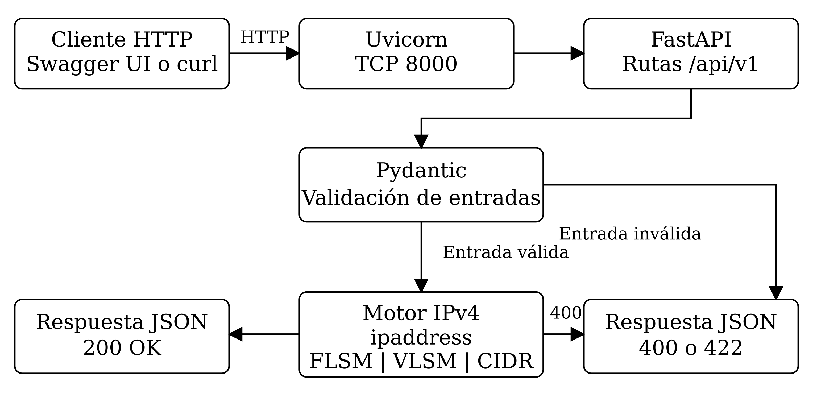
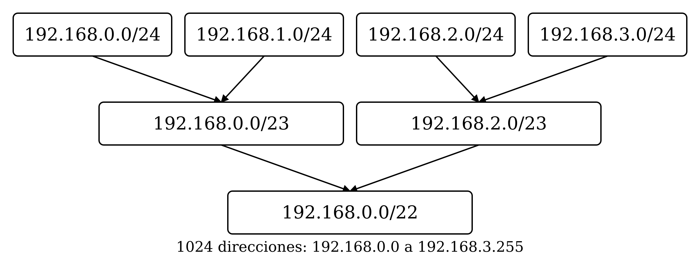

# 1. RESUMEN

NetSegment API es un microservicio que realiza cálculos de direccionamiento IPv4 mediante FLSM, VLSM y agregación CIDR. Este informe establece los procedimientos para instalar sus dependencias, configurar el entorno y ejecutar la versión 1.0.0. La implementación utiliza Python 3.12, FastAPI, Pydantic y Uvicorn; recibe solicitudes JSON y devuelve los parámetros de las redes calculadas. Los datos se procesan en cada solicitud, sin utilizar una base de datos.

La validación registrada comprende 37 pruebas automatizadas y seis comprobaciones HTTP contra un servidor Uvicorn. Los casos incluyen división de redes, asignación según demanda de hosts, agregación exacta y rechazo de entradas inválidas. En el ejemplo VLSM, una red /22 permite asignar 708 direcciones a cuatro segmentos y conservar 316 direcciones sin asignar. El protocolo incorpora los comandos y resultados esperados para que otra persona pueda reproducir la implementación y comprobar su funcionamiento.

# 2. INTRODUCCIÓN

La planificación de una red requiere determinar el tamaño de cada subred, su dirección inicial y el rango de hosts disponibles. Cuando varias áreas tienen necesidades diferentes, una máscara uniforme puede reservar más direcciones de las necesarias. La asignación con prefijos de distinta longitud permite ajustar los bloques a esas demandas; su validez depende de que los prefijos representen espacios de direcciones sin ambigüedad [1].

NetSegment API aplica estos conceptos del curso Computación en Red III mediante un servicio accesible por HTTP. La solución recibe parámetros de direccionamiento y entrega resultados estructurados que pueden consultar estudiantes o consumir otras aplicaciones. El uso de una interfaz web permite integrar operaciones concretas sin exigir un cliente específico, una decisión compatible con los escenarios de integración descritos para servicios REST [2].

El propósito del protocolo es documentar una instalación reproducible. El informe presenta los fundamentos de los cálculos, la organización del software, la configuración necesaria y los criterios de validación. El código fuente y los ejemplos del proyecto constituyen la referencia para los procedimientos de ejecución.

# 3. MARCO TEÓRICO

## 3.1 Direccionamiento IPv4 y prefijos CIDR

Una dirección IPv4 contiene 32 bits. La notación dirección/prefijo indica cuántos bits identifican la red y cuántos quedan para las direcciones del bloque. Para un prefijo p, el tamaño del bloque es 2^(32 - p). En una subred convencional se reservan la dirección de red y la de broadcast, por lo que la capacidad de hosts es 2^(32 - p) - 2. Por ejemplo, un bloque /26 contiene 64 direcciones y admite 62 hosts.

La dirección de red es el primer valor del bloque; el broadcast es el último. La máscara identifica los bits del prefijo y la wildcard expresa su complemento. En NetSegment API estos valores se obtienen con objetos IPv4Network del módulo ipaddress. La implementación exige que la dirección recibida sea la base exacta de la red: 192.168.10.0/24 es válida, mientras que 192.168.10.1/24 se rechaza.

## 3.2 División de redes mediante FLSM

FLSM utiliza una sola longitud de prefijo para todas las subredes de una red base. Si se requieren S subredes, se toma el menor número de bits s que cumpla 2^s >= S. El nuevo prefijo se calcula como p_nuevo = p_base + s. La división conserva el tamaño uniforme de los bloques y facilita identificar sus saltos de dirección.

Para dividir 192.168.10.0/24 en cuatro subredes, s es igual a 2 y el nuevo prefijo es /26. Las direcciones de red avanzan en intervalos de 64: .0, .64, .128 y .192. Cuando se solicitan tres subredes, la implementación entrega cuatro para completar la partición binaria. FLSM reserva red y broadcast y admite como bloque mínimo un /30; esta versión no aplica la excepción de enlaces punto a punto /31.

## 3.3 Asignación de bloques mediante VLSM

VLSM utiliza prefijos diferentes según el número de hosts requerido. La asignación de subredes con longitudes variables exige controlar sus tamaños y evitar prefijos que produzcan ambigüedad o superposición en el espacio disponible [1]. En la implementación se ordenan los requerimientos de mayor a menor y se calcula el bloque mínimo que satisface cada solicitud.

Para una demanda H, se obtiene n = techo(log2(H + 2)) y se asigna un prefijo p = 32 - n. El siguiente bloque comienza después del broadcast anterior. Antes de asignar, el motor comprueba que la suma de los tamaños de bloque no supere la capacidad de la red base. Si la demanda excede esa capacidad, la solicitud se rechaza completa: no se devuelve una asignación parcial.

Debe distinguirse el espacio sin asignar de los hosts libres dentro de los bloques ya asignados. En el ejemplo del proyecto, 708 direcciones pertenecen a las subredes creadas y 316 quedan fuera de ellas. Los bloques asignados ofrecen 700 hosts utilizables para una demanda de 672; los 28 hosts restantes están dentro de esos mismos bloques.

## 3.4 Agregación exacta de redes CIDR

La agregación representa varias redes mediante un prefijo común. Para que el resumen sea exacto, las redes deben formar un espacio continuo, no superponerse y quedar alineadas con el tamaño de la superred. Encontrar un prefijo común por sí solo no garantiza esa condición: un resumen demasiado amplio puede incluir direcciones que no pertenecen al conjunto original.

El motor ordena las redes, compara los límites de cada bloque y utiliza collapse_addresses para obtener el resultado. La operación se acepta únicamente cuando el conjunto se reduce a una sola red. Cuatro bloques consecutivos desde 192.168.0.0/24 hasta 192.168.3.0/24 forman 192.168.0.0/22. Dos redes como 192.168.1.0/24 y 192.168.2.0/24 son contiguas, pero no forman una única superred exacta alineada y se rechazan.

## 3.5 Servicios web y comunicación HTTP

Los servicios web permiten que distintos clientes utilicen una funcionalidad mediante una interfaz de comunicación. La elección del estilo de integración debe responder a las operaciones y requisitos del sistema, como plantean Pautasso, Zimmermann y Leymann en su comparación de servicios REST y WS-* [2]. NetSegment API expone operaciones de cálculo a través de rutas HTTP y utiliza JSON para intercambiar los parámetros y resultados.

Cada solicitud contiene los datos necesarios para resolver la operación. POST se utiliza en los cálculos FLSM, VLSM y CIDR; GET permite consultar el estado y la documentación. Una respuesta correcta devuelve HTTP 200. Los errores de formato o de validación producen 422; las restricciones lógicas de capacidad y agregación producen 400. Esta distinción permite al cliente identificar si debe corregir la estructura de la entrada o los requerimientos del cálculo.

## 3.6 Arquitectura del microservicio

La literatura sobre microservicios describe unidades de software que ejecutan funciones delimitadas y se comunican mediante mecanismos ligeros. También señala la necesidad de definir sus límites y decisiones arquitectónicas [3]. NetSegment API constituye una unidad dedicada al cálculo de redes; no se presenta como un conjunto de varios microservicios desplegados.

Dentro de esa unidad se separan tres responsabilidades: las rutas reciben la solicitud, los modelos validan la entrada y los servicios realizan el cálculo. El servidor Uvicorn atiende la comunicación HTTP mediante ASGI. El comportamiento es stateless: la respuesta depende de la solicitud actual y no necesita una sesión almacenada. Esta organización permite probar los algoritmos y el contrato HTTP por separado.

# 4. DISEÑO DE LA SOLUCIÓN

## 4.1 Información general del proyecto

Tabla N° 2: Identificación del proyecto

| Dato | Información |
|---|---|
| Nombre del proyecto | Desarrollo de un motor de microservicio para segmentación, asignación y agregación de direccionamiento IPv4/IPv6 en entornos de red locales |
| Nombre del sistema | NetSegment API |
| Institución | Universidad Católica de Santa María |
| Facultad | Facultad de Ciencias e Ingenierías Físicas y Formales |
| Escuela profesional | Ingeniería de Sistemas |
| Curso | Computación en Red III |
| Secciones | B y C |
| Grupo | 13 |
| Docente | Javier Fernando Angulo Osorio |
| Fecha de elaboración | 4 de octubre de 2026 |
| Versión del sistema | 1.0.0 |
| Tipo de solución | API REST y microservicio backend |

El nombre del proyecto conserva la denominación del dossier tecnológico. El alcance ejecutable de la versión 1.0.0 corresponde a IPv4. Los integrantes, sus códigos, secciones y participación se consignan en la página de grupo.

## 4.2 Problema, objetivo y alcance

El sistema atiende la necesidad de calcular subredes sin repetir manualmente operaciones sobre máscaras, rangos y límites de bloques. Un cálculo incorrecto puede reservar direcciones insuficientes o producir superposiciones entre segmentos. La solución automatiza la obtención de esos parámetros y valida la capacidad solicitada antes de devolver una asignación.

El objetivo es generar planes de direccionamiento IPv4 válidos a partir de una red base y de los requerimientos de subredes o hosts. Las funcionalidades principales son la división FLSM, la asignación VLSM y la agregación exacta CIDR. Los resultados incluyen direcciones de red, máscaras, wildcard, broadcast y rangos utilizables, según la operación.

La API está dirigida a estudiantes, docentes, administradores de redes y desarrolladores que necesitan incorporar esos cálculos en una aplicación. Su alcance es el procesamiento de direcciones; no modifica la configuración de routers. Swagger UI funciona como cliente de consulta y prueba. La solución no requiere un frontend independiente, almacenamiento persistente ni servicios externos para realizar los cálculos.

## 4.3 Arquitectura y flujo de funcionamiento

El cliente envía una solicitud JSON a Uvicorn. FastAPI selecciona la ruta y Pydantic valida los campos. Cuando la entrada es válida, el motor ejecuta la operación sobre objetos IPv4Network. El resultado se convierte en una respuesta JSON. La figura 1 muestra las rutas de procesamiento y rechazo.



Figura N° 1: Arquitectura de NetSegment API

Fuente: elaboración a partir de app/main.py, app/schemas.py y app/services.py.

La validación de entrada se realiza antes del cálculo. Las comprobaciones de capacidad y agregación pertenecen al motor. Esta separación explica por qué una dirección incorrecta genera 422 y una demanda que no cabe en la red genera 400.

## 4.4 Tecnologías y versiones utilizadas

Tabla N° 3: Tecnologías de ejecución y validación

| Componente | Versión | Función |
|---|---|---|
| Python | 3.12; validado con 3.12.14 | Lenguaje de implementación |
| FastAPI | 0.142.2 | Rutas y documentación OpenAPI |
| Pydantic | 2.13.5 | Validación de solicitudes |
| Uvicorn | 0.54.0 | Servidor ASGI |
| Starlette | 1.7.0 | Infraestructura HTTP |
| python-dotenv | 1.2.4 | Carga de variables de entorno |
| ipaddress | Biblioteca estándar | Operaciones sobre IPv4 |
| pytest | 9.1.1 | Pruebas automatizadas |
| httpx | 0.28.1 | Cliente de pruebas HTTP |

requirements.txt contiene las dependencias de ejecución directas y transitivas con sus versiones fijadas. requirements-dev.txt añade las herramientas de validación. Se utiliza Git para el control de versiones y GitHub como repositorio del proyecto. El entorno de despliegue recomendado es Ubuntu Server 24.04 LTS. No se requiere un motor de base de datos ni una API externa.

## 4.5 Contrato de la API

Tabla N° 4: Rutas y entradas principales

| Método y ruta | Entrada | Resultado |
|---|---|---|
| GET /health | Sin cuerpo | Estado y versión del servicio |
| POST /api/v1/subnetting/flsm | network, subnets_needed | Subredes de tamaño uniforme |
| POST /api/v1/subnetting/vlsm | base_network, departments | Bloques por demanda de hosts |
| POST /api/v1/supernetting/aggregate | networks | Superred CIDR exacta |

Las rutas de cálculo devuelven status igual a success y un objeto data. Los errores lógicos incluyen status igual a error, error_code y message. El contrato completo está disponible en /openapi.json y en docs/openapi.json. La interfaz /docs presenta los esquemas y permite ejecutar solicitudes desde el navegador.

La entrada admite redes IPv4 expresadas como dirección base/prefijo. Las cantidades son enteros estrictos; no se aceptan cadenas ni booleanos como sustitutos. Se rechazan los campos adicionales y los nombres repetidos de departamentos. Los límites son 4096 subredes solicitadas en FLSM, 1024 departamentos en VLSM y 4096 redes para agregación.

## 4.6 Organización del código fuente

Tabla N° 5: Componentes del repositorio

| Archivo o directorio | Responsabilidad |
|---|---|
| app/main.py | Rutas FastAPI, estado y manejo de errores |
| app/schemas.py | Modelos y restricciones de entrada |
| app/services.py | Algoritmos FLSM, VLSM y CIDR |
| app/__main__.py | Configuración e inicio de Uvicorn |
| app/__init__.py | Versión del sistema |
| examples/ | Solicitudes JSON para las pruebas |
| tests/ | Pruebas automatizadas del contrato y los cálculos |
| scripts/smoke_test.py | Comprobaciones contra un servidor HTTP |
| deploy/netsegment.service | Unidad de servicio systemd |
| docs/ | Protocolo, informe, diagramas y validación |

# 5. EXPERIENCIAS DE PRÁCTICA

## 5.1 Preparación e implementación

La configuración se organizó alrededor de un entorno virtual para aislar las dependencias del sistema operativo. Se fijaron las versiones en los archivos de requisitos y se estableció python -m app como punto de entrada. Ese comando carga .env desde la raíz del proyecto y permite modificar la dirección de escucha, el puerto y el nivel de registro sin cambiar el código.

La revisión de los ejemplos permitió diferenciar los hosts utilizables del tamaño total de los bloques. Para las demandas de 500, 120, 50 y 2 hosts, los bloques /23, /25, /26 y /30 ocupan 708 direcciones. El espacio restante en la red /22 es 316. La comprobación aritmética se incorporó a las pruebas para evitar confundir ese valor con la capacidad libre dentro de las subredes asignadas.

## 5.2 Validación funcional registrada

La verificación se realizó en Linux x86_64 con Python 3.12.14. Se comprobó la instalación en un entorno virtual nuevo, la consistencia de las dependencias y el funcionamiento de Uvicorn. La tabla 6 resume los resultados registrados en docs/VALIDACION.md.

Tabla N° 6: Resultados de validación de la versión 1.0.0

| Comprobación | Evidencia | Resultado |
|---|---|---|
| Pruebas automatizadas | python -m pytest -q | 37 pruebas correctas |
| Dependencias | python -m pip check | Sin conflictos de requisitos |
| Servidor HTTP | Proceso Uvicorn y script de comprobación | Seis comprobaciones correctas |
| Estado del sistema | GET /health | 200; versión 1.0.0 |
| FLSM | /24 y cuatro subredes | Cuatro bloques /26 |
| VLSM | /22 y cuatro demandas | 708 direcciones asignadas |
| Agregación CIDR | Cuatro redes /24 | 192.168.0.0/22 |
| Entrada inválida | Dirección con octeto 300 | HTTP 422 |
| Capacidad insuficiente | 500 hosts en /24 | HTTP 400 |

El puerto 18000 se utilizó en la comprobación del servidor; el valor predeterminado del proyecto es 8000. El proceso de prueba se cerró al finalizar. Se registró una advertencia de deprecación de Starlette relacionada con httpx, sin fallos en los casos verificados. Los resultados corresponden a funcionalidad e instalación; no constituyen una medición de rendimiento o concurrencia.

# 6. ACTIVIDADES DE IMPLEMENTACIÓN

## 6.1 Requisitos del entorno

Tabla N° 7: Requisitos de implementación

| Recurso | Mínimo orientativo | Recomendado |
|---|---|---|
| CPU | Un núcleo | Dos núcleos |
| RAM disponible | 512 MB | 2 GB |
| Disco libre | 500 MB | 5 GB en SSD |
| Sistema operativo | Linux con Python 3.12 | Ubuntu Server 24.04 LTS |
| Red | Acceso para descargas | Conexión estable para clientes |

Se necesitan Git, Python, pip, venv y una terminal. Un navegador y curl permiten verificar las operaciones. Uvicorn es el servidor de la aplicación. El puerto TCP 8000 debe estar disponible o sustituirse por otro valor en .env. Para instalar las dependencias se necesita acceso a PyPI; para descargar el código, a GitHub. Las interfaces Swagger UI y ReDoc cargan recursos desde cdn.jsdelivr.net y requieren acceso a ese dominio desde el navegador. El cálculo y los clientes curl no dependen del CDN. Los requisitos de hardware orientan una instalación de laboratorio y no expresan una capacidad medida bajo carga.

## 6.2 Instalar las herramientas

Ejecutar en Ubuntu 24.04 o una distribución compatible:

```bash
sudo apt update
sudo apt install -y git python3 python3-venv python3-pip curl unzip
python3 --version
git --version
```

Resultado esperado: herramientas instaladas y Python 3.12 disponible. Si la distribución proporciona otra versión, instalar Python 3.12 con su gestor antes de crear el entorno; no reutilizar un entorno creado con otro intérprete.

## 6.3 Descargar el proyecto e identificar la versión

Para instalar desde el paquete NetSegment_API_Grupo_13.zip, extraerlo en un directorio nuevo:

```bash
unzip NetSegment_API_Grupo_13.zip
cd 13_NetSegmentAPI
```

Resultado esperado: código, dependencias, ejemplos y documentación disponibles en 13_NetSegmentAPI. Usar ese directorio como raíz en los pasos siguientes. La extracción no genera un historial Git. La versión instalada se identifica por app/__init__.py y /health.

Para obtener una copia con historial Git, utilizar:

```bash
git clone https://github.com/DanielUCSM/X_NetSegment-API.git netsegment
cd netsegment
git branch --show-current
git rev-parse HEAD
```

Resultado esperado: copia local en netsegment, rama main y un identificador completo de commit. Registrar ese identificador durante la demostración para relacionar la ejecución con el código entregado. Después del cambio de nombre, sustituir la URL por la del repositorio 13_NetSegmentAPI; el directorio local puede seguir llamándose netsegment.

## 6.4 Crear y activar el entorno virtual

```bash
python3 -m venv .venv
source .venv/bin/activate
python --version
python -m pip --version
```

Resultado esperado: directorio .venv y comandos asociados a ese entorno. La ruta de pip debe contener .venv. Mantener el entorno activado para los pasos siguientes.

## 6.5 Instalar dependencias

```bash
python -m pip install -r requirements.txt
python -m pip check
```

Resultado esperado: instalación de las versiones fijadas y mensaje No broken requirements found. Si falla una descarga, resolver la conexión y repetir la instalación; conservar las versiones fijadas en requirements.txt.

## 6.6 Base de datos y configuraciones iniciales

No corresponde crear una base de datos. El sistema no contiene modelos persistentes, scripts SQL, migraciones ni datos semilla. Todas las entradas necesarias se envían en cada solicitud.

Resultado esperado: los cálculos funcionan sin servicios SQL y sin directorios de datos persistentes.

## 6.7 Configurar las variables de entorno

```bash
cp .env.example .env
```

El contenido local de ejemplo es:

```text
HOST=127.0.0.1
PORT=8000
LOG_LEVEL=info
```

Resultado esperado: archivo .env en la raíz, con un puerto libre y sin credenciales. Cuando se trabaja en una copia con historial Git, el archivo no aparece como pendiente de commit porque .gitignore lo excluye. En esa copia, comprobarlo con:

```bash
git check-ignore .env
```

Resultado esperado en una copia Git: salida .env. Esta comprobación se utiliza en un repositorio clonado; el paquete ZIP no incluye historial Git. Si el puerto está ocupado, editar PORT y utilizar el mismo valor en los comandos y en el navegador.

## 6.8 Compilación del proyecto

Python ejecuta el código sin un proceso de construcción previo. La instalación no necesita npm, un bundle de frontend ni compilación nativa de la aplicación. De forma opcional puede verificarse la sintaxis:

```bash
python -m compileall -q app
```

Resultado esperado: salida sin errores. Los archivos de caché generados quedan excluidos del repositorio. Esta comprobación no reemplaza las pruebas funcionales.

## 6.9 Ejecutar el backend

```bash
python -m app
```

Resultado esperado: mensajes de inicio de Uvicorn y escucha en http://127.0.0.1:8000 con la configuración de ejemplo. Mantener abierta la terminal; Ctrl+C detiene el proceso.

Para editar código durante el desarrollo puede iniciarse una sesión alternativa, después de detener la anterior:

```bash
python -m uvicorn app.main:app \
  --host 127.0.0.1 --port 8000 --reload
```

Resultado esperado: reinicio automático ante cambios. Este comando usa argumentos y no carga el .env del proyecto. La recarga automática es solo para desarrollo.

## 6.10 Ejecutar la interfaz cliente

Abrir http://127.0.0.1:8000/docs en un navegador. La página se sirve desde FastAPI y no requiere ejecutar un frontend separado. Seleccionar una ruta POST, pulsar Try it out, escribir el JSON del ejemplo y pulsar Execute. /redoc ofrece otra vista de documentación y /openapi.json entrega el contrato.

Resultado esperado: rutas visibles y respuestas de la API en la misma página. Si la interfaz no carga por falta de acceso al CDN, comprobar /health y /openapi.json y utilizar curl o scripts propios como clientes alternativos.

## 6.11 Comprobar disponibilidad y operaciones

Abrir una segunda terminal en la raíz de la copia instalada y activar .venv. Los siguientes comandos se ejecutan desde la raíz del proyecto mientras el backend continúa iniciado:

```bash
source .venv/bin/activate
curl -fsS http://127.0.0.1:8000/health
python scripts/smoke_test.py
```

Resultado esperado: status ok, versión 1.0.0 y seis comprobaciones HTTP correctas. Si se cambió el puerto, indicar la URL al script, por ejemplo python scripts/smoke_test.py http://127.0.0.1:8001.

### 6.11.1 Verificación FLSM

```bash
curl -fsS -X POST \
  http://127.0.0.1:8000/api/v1/subnetting/flsm \
  -H 'Content-Type: application/json' \
  --data @examples/flsm.json
```

Resultado esperado: HTTP 200, cuatro subredes /26 y 62 hosts utilizables por subred. Sus redes son 192.168.10.0, 192.168.10.64, 192.168.10.128 y 192.168.10.192. La última dirección broadcast es 192.168.10.255.

### 6.11.2 Verificación VLSM

```bash
curl -fsS -X POST \
  http://127.0.0.1:8000/api/v1/subnetting/vlsm \
  -H 'Content-Type: application/json' \
  --data @examples/vlsm.json
```

Resultado esperado: HTTP 200 y la siguiente distribución, en orden descendente de demanda:

Tabla N° 8: Asignación VLSM del caso de prueba

| Departamento | Hosts solicitados | Bloque asignado | Hosts utilizables |
|---|---|---|---|
| Ingenieria | 500 | 172.16.0.0/23 | 510 |
| Ventas | 120 | 172.16.2.0/25 | 126 |
| Servidores | 50 | 172.16.2.128/26 | 62 |
| Enlace-WAN | 2 | 172.16.2.192/30 | 2 |

La red /22 tiene 1024 direcciones. Los bloques ocupan 708 y quedan 316 sin asignar. La capacidad utilizable de hosts suma 700, frente a 672 hosts pedidos; quedan 28 espacios de hosts dentro de los bloques asignados. El espacio sin asignar y los hosts libres dentro de los bloques se registran como magnitudes distintas.

### 6.11.3 Verificación CIDR

```bash
curl -fsS -X POST \
  http://127.0.0.1:8000/api/v1/supernetting/aggregate \
  -H 'Content-Type: application/json' \
  --data @examples/aggregate.json
```

Resultado esperado: HTTP 200, ruta 192.168.0.0/22, máscara 255.255.252.0, wildcard 0.0.3.255 y reducción de cuatro rutas a una, equivalente al 75 %. La agregación no incluye direcciones ajenas a las redes recibidas.



Figura N° 2: Agregación exacta de cuatro redes /24

Fuente: elaboración a partir de examples/aggregate.json y app/services.py.

## 6.12 Validar entradas y errores

El script de comprobación ya incluye una IPv4 inválida y una solicitud que excede la capacidad. Para observar manualmente un error de sintaxis:

```bash
curl -sS -i -X POST \
  http://127.0.0.1:8000/api/v1/subnetting/flsm \
  -H 'Content-Type: application/json' \
  -d '{"network":"192.168.1.300/24","subnets_needed":4}'
```

Resultado esperado: HTTP 422 y detalle de validación. El comando no usa -f para permitir ver el cuerpo del error. Los errores lógicos usan HTTP 400 y los campos status, error_code y message. Una ruta inexistente produce 404.

Las redes deben ser direcciones base exactas con prefijo CIDR. Los valores enteros son estrictos: los valores deben ser enteros y no booleanos ni cadenas. No se permiten campos adicionales. Los nombres de departamentos no pueden repetirse. FLSM puede devolver más subredes que las solicitadas al completar una potencia de dos. FLSM y VLSM asignan como mínimo /30, reservando red y broadcast. CIDR exige continuidad, ausencia de solapamiento y alineamiento exacto de una sola superred.

## 6.13 Ejecutar las pruebas automatizadas

```bash
python -m pip install -r requirements-dev.txt
python -m pytest -q
python -m pip check
```

Resultado esperado para esta versión: 37 pruebas correctas y dependencias sin conflictos. Se comprueban los ejemplos, límites de hosts, capacidad insuficiente, ausencia de solapamientos, rechazo de entradas inválidas, comportamiento HTTP y agregación exacta. El cliente de pruebas puede emitir una advertencia de deprecación de Starlette sobre httpx; en la verificación registrada no produjo fallos.

La instalación de requirements-dev.txt también se verificó en un entorno virtual nuevo para comprobar la resolución de dependencias desde los archivos entregados. Las comprobaciones HTTP se realizaron con un proceso Uvicorn real. No se midieron carga, concurrencia máxima ni latencia y no se realizó una auditoría de seguridad.

## 6.14 Instalar un servicio persistente en Ubuntu Server

La instalación persistente en Ubuntu Server utiliza systemd y requiere permisos administrativos en el servidor de destino. Primero completar 6.2 y comprobar que /opt/netsegment no contiene otra instalación que deba conservarse.

Crear una cuenta de servicio sin inicio de sesión y clonar el código:

```bash
sudo useradd --system --user-group --no-create-home \
  --shell /usr/sbin/nologin netsegment
sudo git clone \
  https://github.com/DanielUCSM/X_NetSegment-API.git \
  /opt/netsegment
sudo python3 -m venv /opt/netsegment/.venv
sudo /opt/netsegment/.venv/bin/python -m pip install \
  -r /opt/netsegment/requirements.txt
```

Resultado esperado: usuario y grupo netsegment, código en /opt/netsegment y entorno con dependencias instaladas. Si la cuenta ya existe, comprobarla con id netsegment y omitir useradd.

Configurar el archivo local e instalar la unidad:

```bash
sudo install -o netsegment -g netsegment -m 600 \
  /opt/netsegment/.env.example /opt/netsegment/.env
sudo install -m 644 \
  /opt/netsegment/deploy/netsegment.service \
  /etc/systemd/system/netsegment.service
sudo systemctl daemon-reload
sudo systemctl enable --now netsegment
sudo systemctl status netsegment --no-pager
curl -fsS http://127.0.0.1:8000/health
```

Resultado esperado: servicio active (running), inicio habilitado al arrancar el servidor y disponibilidad HTTP 200 desde el mismo servidor. La unidad ejecuta el proceso con una cuenta restringida, reinicia ante fallos y protege el sistema de archivos. El ejemplo conserva la escucha local; para clientes de otros equipos se requiere la configuración de acceso institucional.

Consultar registros y detener el servicio:

```bash
sudo journalctl -u netsegment -n 50 --no-pager
sudo systemctl stop netsegment
```

Resultado esperado: registros de Uvicorn y servicio detenido después de stop. Reiniciar con sudo systemctl start netsegment cuando corresponda. Una eventual publicación HTTPS y su autenticación son responsabilidad de la infraestructura y no están instaladas por estos comandos.

## 6.15 Actualizar y recuperar una versión

Registrar el commit actualmente instalado antes de actualizar:

```bash
sudo git -C /opt/netsegment rev-parse HEAD
sudo git -C /opt/netsegment pull --ff-only
sudo /opt/netsegment/.venv/bin/python -m pip install \
  -r /opt/netsegment/requirements.txt
sudo /opt/netsegment/.venv/bin/python -m pip check
sudo systemctl restart netsegment
curl -fsS http://127.0.0.1:8000/health
```

Resultado esperado: actualización sin sobrescribir cambios locales y servicio correcto. Si la validación falla, detener el servicio, restaurar el commit previamente registrado mediante git checkout y reinstalar sus dependencias antes de reiniciar. La recuperación no implica restaurar una base de datos porque el servicio no persiste información.

## 6.16 Solucionar incidencias frecuentes

Tabla N° 9: Incidencias y acciones de recuperación

| Síntoma | Causa probable | Acción y resultado esperado |
|---|---|---|
| No module named fastapi | Entorno inactivo o instalación incompleta | Activar .venv e instalar requirements.txt; el módulo queda disponible |
| No module named app | Ejecución fuera de la raíz | Entrar a netsegment; python -m app inicia el servidor |
| Address already in use | Puerto ocupado | Detener el otro proceso o editar PORT; Uvicorn inicia en el puerto libre |
| Connection refused | Backend detenido o URL incorrecta | Iniciar el proceso y revisar HOST/PORT; /health responde 200 |
| HTTP 422 | CIDR o campos inválidos | Comparar con examples y /docs; una entrada válida responde 200 |
| HTTP 400 en VLSM | Bloques requeridos exceden la red | Aumentar la red base o reducir demanda; asignación completa válida |
| HTTP 400 en CIDR | Solapamiento, discontinuidad o alineamiento | Corregir las redes; la unión debe ser una sola superred exacta |
| Servicio systemd failed | Ruta, dependencia, puerto o .env incorrectos | Revisar journalctl y la unidad; después corregir y reiniciar |

# 7. REPOSITORIO GITHUB

## 7.1 Identificación y contenido de la entrega

La dirección de referencia del proyecto es https://github.com/DanielUCSM/X_NetSegment-API. La estructura exigida para el nombre de entrega es NumeroGrupo_TituloProyecto; para este equipo corresponde 13_NetSegmentAPI. El propietario configura ese nombre en Settings, apartado General, campo Repository name. Después de guardar, la URL del repositorio y el remoto de las copias locales deben corresponder al nombre elegido.

Tabla N° 10: Archivos requeridos para la entrega

| Elemento | Archivo o ubicación |
|---|---|
| Código fuente | app/ |
| Presentación e instalación básica | README.md |
| Dependencias de ejecución | requirements.txt |
| Dependencias de validación | requirements-dev.txt |
| Variables de entorno de ejemplo | .env.example |
| Solicitudes reproducibles | examples/ |
| Pruebas del sistema | tests/ y scripts/smoke_test.py |
| Despliegue persistente | deploy/netsegment.service |
| Informe y protocolo | docs/ |

El README conserva la descripción del sistema y su diagrama de funcionamiento. Incluye integrantes, tecnologías, requisitos y comandos básicos. El informe técnico desarrolla los fundamentos y el procedimiento completo; ambos documentos deben describir la misma versión del código.

## 7.2 Actualización de main y trazabilidad

La actualización del proyecto se realiza en main. Antes de preparar un commit, revisar el estado y los archivos que se incluirán. Desde la raíz de una copia con historial Git:

```bash
git switch main
git fetch origin
git status
git diff
```

Resultado esperado: rama main activa, referencias remotas actualizadas y cambios locales identificados. Integrar los cambios remotos antes de publicar. Si ambos historiales ya están relacionados y el árbol de trabajo está limpio, utilizar git pull --ff-only. Si Git informa una divergencia, resolverla antes de continuar.

Cuando una fusión está detenida por un conflicto en README.md y se desea conservar la versión del repositorio remoto, ejecutar desde esa misma fusión:

```bash
git restore --source=origin/main -- README.md
git add README.md
git commit --no-edit
```

Resultado esperado: conflicto resuelto con el README remoto y commit de fusión creado. Estos comandos se aplican únicamente a una fusión pendiente. Revisar después que el README contenga las instrucciones vigentes.

Para registrar nuevos cambios, añadir únicamente los archivos revisados; por ejemplo, una actualización de documentación:

```bash
git add docs/
git diff --cached --stat
git commit -m "Actualizar informe técnico UCSM"
git push origin main
git rev-parse HEAD
```

Resultado esperado: commit enviado a main e identificador disponible para la revisión. La demostración debe utilizar una copia correspondiente a ese commit y a la versión 1.0.0 indicada por /health. Las credenciales de acceso se gestionan en Git o GitHub y no se escriben en el código ni en este informe.

## 7.3 Invitación del docente

La guía exige invitar a jangulo@ucsm.edu.pe como colaborador antes de la presentación. El propietario o un administrador del repositorio realiza el procedimiento en Settings, apartado Collaborators, mediante Add people. Buscar el correo institucional, comprobar el destinatario y enviar la invitación.

Resultado esperado: invitación visible en la lista de colaboradores o de invitaciones pendientes. Conservar esa comprobación para la revisión del proyecto. El envío y la aceptación son estados distintos; el requisito de la guía corresponde al envío previo a la presentación.

## 7.4 Protección de la configuración local

El repositorio entrega .env.example con HOST, PORT y LOG_LEVEL. La configuración particular se almacena en .env y queda excluida mediante .gitignore, junto con el entorno virtual y las cachés. Antes de un commit, revisar git diff --cached y confirmar que no incluya contraseñas, tokens, certificados privados ni datos personales ajenos a la identificación académica.

Resultado esperado: archivos de configuración reproducibles y ausencia de credenciales reales en los cambios preparados. Una credencial publicada por error requiere revocación y revisión del historial; borrarla en un commit posterior no elimina su exposición previa.

# 8. CONCLUSIONES DE LA PRÁCTICA

La versión 1.0.0 puede ejecutarse en un entorno virtual Python 3.12 con las dependencias fijadas en el repositorio. El punto de entrada python -m app carga la configuración local e inicia Uvicorn. Los ejemplos y las comprobaciones HTTP permiten verificar la instalación desde otra terminal sin utilizar una aplicación cliente adicional.

Las pruebas diferencian los errores de entrada de las restricciones del cálculo. Una IPv4 inválida recibe HTTP 422; una demanda VLSM que excede la red recibe HTTP 400. Ese comportamiento evita entregar una asignación parcial como si fuera un resultado correcto.

El caso VLSM confirma la diferencia entre direcciones sin asignar y hosts libres dentro de las subredes. Los cuatro bloques ocupan 708 direcciones del /22 y dejan 316 fuera de la asignación. Dentro de los bloques existen 700 hosts utilizables para una demanda de 672. Esta distinción debe mantenerse al interpretar la respuesta de la API.

La agregación CIDR reduce las cuatro redes /24 del ejemplo a una única /22 sin incorporar direcciones adicionales. Las comprobaciones de continuidad y alineamiento son necesarias para que esa reducción represente exactamente el conjunto recibido.

La validación registrada comprende 37 pruebas automatizadas, seis comprobaciones HTTP y una instalación de dependencias en un entorno nuevo. Estos resultados sustentan el funcionamiento de los casos documentados. El procedimiento de despliegue persistente permite trasladar la ejecución a un servidor Ubuntu mediante systemd y verificarla con /health.

# 9. BIBLIOGRAFÍA

[1] M. J. Atallah y D. E. Comer, “Algorithms for variable length subnet address assignment,” IEEE Transactions on Computers, vol. 47, n.° 6, pp. 693–699, jun. 1998, doi: 10.1109/12.689648.

[2] C. Pautasso, O. Zimmermann y F. Leymann, “RESTful web services vs. ‘big’ web services: Making the right architectural decision,” en Proceedings of the 17th International Conference on World Wide Web (WWW ’08), Beijing, China, 2008, pp. 805–814, doi: 10.1145/1367497.1367606.

[3] P. Di Francesco, P. Lago e I. Malavolta, “Architecting with microservices: A systematic mapping study,” Journal of Systems and Software, vol. 150, pp. 77–97, abr. 2019, doi: 10.1016/j.jss.2019.01.001.
